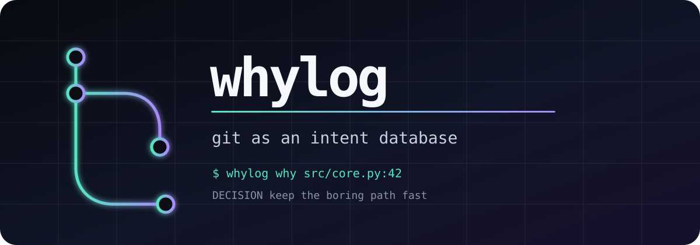

<p align="center">
  
</p>

<p align="center">
  <a href="https://github.com/ASVLCII/Whylog/actions/workflows/test.yml"></a>
  <a href="https://www.python.org/downloads/"></a>
  <a href="LICENSE"></a>
  
</p>

<p align="center"><strong>Your code remembers what changed. Whylog remembers why.</strong></p>

Whylog stores engineering decisions next to the code they explain. Each entry
is a small JSON record attached to commit and blob object IDs through Git
notes. Ask about a line later and Whylog follows `git blame` back to its intent.

No service. No database. No package dependency. Just one Python file and Git.

## Features

- **Line-level answers.** `whylog why path:line` connects blame output to the
  decision stored on the matching blob or commit.
- **Three useful records.** Save a `Decision`, a `Rejected` alternative, or an
  executable `Watch` that protects an assumption.
- **AI context without prompt storage.** Whylog records the model name and a
  SHA-256 prompt hash, not the prompt itself.
- **Git-native storage.** Notes live at `refs/notes/ai`, can be pushed beside
  normal refs, and follow rewritten commits through `notes.rewriteRef`.
- **Readable terminal output.** Status, progress and errors use ANSI color on
  interactive terminals and respect `NO_COLOR` everywhere else.
- **Portable by default.** The script uses only the Python standard library
  and is tested on Linux, macOS and Windows.

## Download

Download the latest script directly:

```bash
curl -fsSLO https://raw.githubusercontent.com/ASVLCII/Whylog/main/whylog.py
```

Or clone the repository:

```bash
git clone https://github.com/ASVLCII/Whylog.git
cd Whylog
```

## Installation

Whylog requires Python 3.9 or newer and Git 2.30 or newer.

### macOS and Linux

```bash
install -m 755 whylog.py ~/.local/bin/whylog
```

Make sure `~/.local/bin` is on your `PATH`.

### Windows

Keep `whylog.py` anywhere convenient and add its directory to `PATH`, then use
`python whylog.py`. You can also add a `whylog.cmd` file beside it:

```bat
@python "%~dp0whylog.py" %*
```

## Quickstart

Commit the code first, then attach the reason to that commit and its relevant
blob. Repeat `--file` when one decision covers several files.

```bash
git commit -am "fix: bound retry delay"

whylog log \
  --type Decision \
  --why "Cap retries at 30 seconds to keep cancellation responsive" \
  --prompt "Fix runaway retry delays" \
  --model "muse-spark-1.3" \
  --file src/retry.py
```

Ask why a line exists:

```console
$ whylog why src/retry.py:42
@ src/retry.py:42  a91e6f0d2c
  DECISION  Cap retries at 30 seconds to keep cancellation responsive
  w4f8c02ac11  muse-spark-1.3  sha256:8d0...
```

Share the intent database with collaborators:

```bash
git push origin refs/notes/ai
git fetch origin refs/notes/ai:refs/notes/ai
```

## Usage

### Record a decision

```bash
whylog log --type Decision --why "Use SQLite for atomic local state" \
  --prompt "Persist jobs safely" --model "model-name" --file src/store.py
```

### Record a rejected option

```bash
whylog log --type Rejected --why "JSON cannot make concurrent writes atomic" \
  --prompt "Persist jobs safely" --model "model-name" --file src/store.py
```

### Add a Watch

A Watch runs its command when a changed or untracked path matches its glob.
Watch commands are trusted project code and run through the system shell.

```bash
whylog log --type Watch \
  --why "The wire format must remain backward compatible" \
  --model "model-name" \
  --watch-glob "src/protocol/*.py" \
  --watch-run "python -m unittest tests.test_protocol" \
  --file src/protocol/message.py

whylog check
```

### Browse the log

```bash
whylog list
whylog list --type Watch
```

### Command reference

| Command | Purpose |
| --- | --- |
| `whylog log` | Attach intent to a commit and optional file blobs |
| `whylog why path:line` | Explain a committed line through blame and notes |
| `whylog list [--type TYPE]` | List unique intent records |
| `whylog check` | Run Watches matching current changes |

Run `whylog COMMAND --help` for every option.

## How it works

Whylog writes compact JSON arrays to `refs/notes/ai`. The same record ID can
appear on a commit and several blobs; `whylog list` deduplicates those copies.
The first write also configures this repository with:

```ini
[notes]
    rewriteRef = refs/notes/ai
```

That tells supported Git rewrite commands to copy Whylog notes when commits
are rewritten. Git notes are separate refs, so remember to push and fetch them
explicitly.

## Tests

The test suite creates disposable Git repositories and exercises note writes,
blob and commit linkage, blame lookup, deduplication, Watch execution and error
handling.

```bash
python -m py_compile whylog.py test_whylog.py
python -m unittest -v
python whylog.py --help
```

GitHub Actions runs the suite on Python 3.9 and 3.13 across Ubuntu, macOS and
Windows.

## Contributing

Read [CONTRIBUTING.md](CONTRIBUTING.md) before opening a pull request. Small,
focused changes are easiest to review. Whylog intends to remain a dependency-
free, single-file tool unless a real limitation forces that to change.

## License

[MIT](LICENSE) © 2026 ASVLCII
